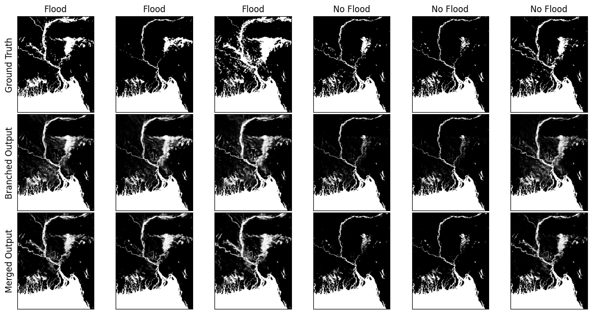

# ProjectFlood

This project looks at predicting flood risk on a pixel-by-pixel basis. It primarily uses ConvLSTM architectures, making use of satellite and renalysis data sets, and focuses on Bangladesh. Images were roughly at a 2km resolution.

This project was a Masters thesis submission.

## Table of Contents
- [Usage](#usage)
- [Model Architectures](#model-architectures)
- [Example Model Outputs](#example-model-outputs)

## Usage

The project requires the user to set up appropriate environment variables that map to json files. Each JSON file should contain the relevant file paths required. This is the primary way to handle file paths in the code. The user must also set up a Google Earth Engine and Google Drive API and store their credentials. Moreover, the user must gain access to the MSWEP precipitation data set. The user must also process raw Dartmouth Flood Observatory flood events prior to use.

- The **data_extraction** folder holds scripts that are used to pull data. data_pull_main.py is the primary file used to extract data. It reads in the processed flood event spreadsheet made by the user, then extracts a specified number of non-flood events.
- The **dataloaders** folder holds the Pytorch datasets needed for the modelling
- The **models** folder holds the Pytorch modules
- The **model_runs** folder holds the scripts for running the models. There are various configurations depending on the set up and memory required for the model. Some require parameters to be manually updated by the user in the script. Others read in paramters passed in via command-line arguments
- The **scripts** folder holds scripts for submitting the 'model_runs' scripts to a slurm GPU cluster
- The **visualisations** folder contains plotting helpers to visualise model outputs and explore the datasets used
- The **evaluation** folder has scripts used to evaluate model performance. It also contains a script to find pixels which are permanently water across all flood and non-flood images, used when evaluating performance.

## Model Architectures
**Branched approach:**

**Merged approach:**

## Example Model Outputs
**Model outputs:**

**Pixel differences:**

**Example risk map:**

